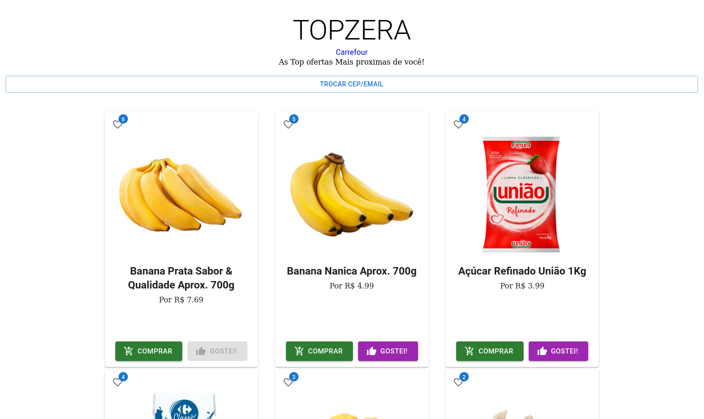
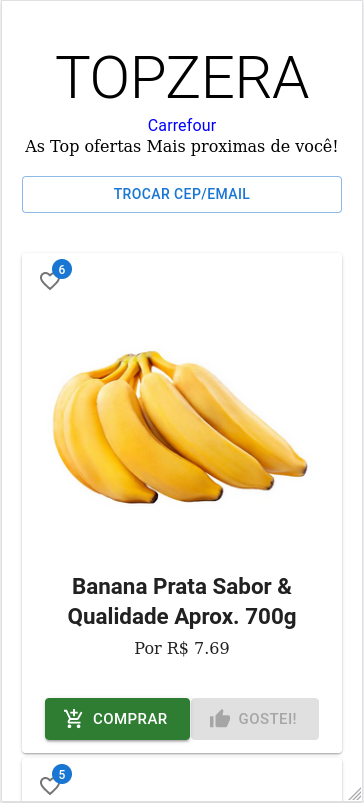

# TOPZERA Carrefour
#### API Rest and React JS front end for the DIO TECH Carrefour project

## About the Project

The TOPZERA Carrefour project use the endpoints from Tech DIO Carrefour challenge to get all products near from the CEP and show them ordering by how much "likes" the product own.

To do it, I created an API Rest with java and spring boot framework, that will consume the Carrefour API and compare with the likes that has been saved on database, a mirror model from products has been created to handle the carrefour api information and add them likes attributes. this API has also and endpoint that receive user email and product ID to create a "LIKE" and send it to KAFKA and the TOPZERA microservice take the likes queue from the KAFKA and save them in the Mongo database.

The front end has been created with React JS and Redux to make the communication easier with all components and the stored objects(Likes, User Info and Products).
When the user enter with Email and CEP, the client will request to endpoint from TOPZERA API all the likes by user email and all the products from the nearlist carrefour store and its all the likes that it has gotten. then, the front end will order the products and store them at a Redux Store and show the products page.
User will be able to like a product, the product list will be ordered by its likes again. User are also going to be able to add the product to cart in the carrefour site.

### Built with
**Front End**
- Node v16.15.0
- React JS v18.1.0
- Redux
- @Mui (Materialize)
- Axios
- Styled Components

**Back End**
- Java 11
- Spring Boot Framework v2.7.0
- Webflux
- Springdoc - OpenAPI
- Lombok
- Maven

**Docker**
- Kafka
- MomgoDB

## Getting Started
**Front End**
Open the client/topzera folder on your prefer IDE and run the command:
- npm i
- npm run start

**Back End**
Open the server/topzera and the server/topzera-ms on your prefer IDE wait for the maven to load all the dependencies, then, run the spring boot application class (TopzeraApplication and TopzeraMsApplication

**Docker**
open in the command line the path docker/kafka and run the command:
- docker-compose up -d

open in the command line the path docker/mongo and run the command:
- docker-compose up -d

> Take a double check on the docker service, sometimes they do not get start correctly

### Installation
1. clone the project

**Front end**
2. Install node version 16.15.0
> https://github.com/rafa-maciel/dio-tech-day-carrefour.git
3. navigate to the path client/topzera and run
> npm i
4. run the start server
> npm run start

**Back end**
5. Install java JDK 11
6. Open the project folder server/topzera on your idea and wait for the maven to load all dependencies
7. Run the Boot Application
8. Open the project folder server/topzera-ms on your idea and wait for the maven to load all dependencies
9. Run the Boot Application

**Dockker**
10. Install the Docker
11. navigate to the path docker/kafka
12. run the command
> docker-compose up -d
13. navigate to the path docker/momgo
14. run the command
> docker-compose up -d

